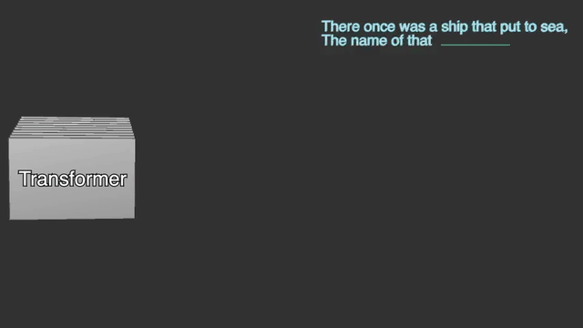

# Animations (ManimGL)

This project contains a collection of ManimGL scenes for generating math and ML animations.

Attribution: Portions of the code are adapted from 3Blue1Brown's public "videos" repository.
- 3b1b videos repo: https://github.com/3b1b/videos

## Quick Start

Common flags:
- `-l | -m | --hd | --uhd`: resolution presets (480p / 720p / 1080p / 4k)
- `-w`: write a movie file (MP4 by default)
- `-i`: write a GIF instead of MP4
- `-s`: save the last frame as PNG (when combined with `-w`)
- `--file_name <name>`: set output filename
- `--video_dir <path>`: set output directory
- `-o`: open the output when done; `--finder`: reveal in Finder (macOS)

## Examples

- Save an MP4 at low resolution:
  - `python -m manimlib generation.py SimpleAutogregression -l -w`
- Save a GIF at low resolution:
  - `python -m manimlib generation.py SimpleAutogregregression -l -w -i --file_name simple_auto`
- Save a 10-second GIF (convert first 10s of MP4 for best quality):
  1) `python -m manimlib generation.py SimpleAutogregression -l -w --file_name simple_auto`
  2) `ffmpeg -y -t 10 -i videos/simple_auto.mp4 -vf "fps=12,scale=640:-1:flags=lanczos,split[s0][s1];[s0]palettegen[p];[s1][p]paletteuse" videos/simple_auto_10s.gif`

## Requirements

- Python 3.10 (project uses ManimGL / `manimlib`)
- `ffmpeg` available on PATH
- Optional (for LaTeX-based `Tex`/`MathTex` objects in some scenes): a TeX distribution with `latex`/`xelatex` and `dvisvgm` available on PATH

## Notes

- Some scenes reference assets or helpers typical of the 3b1b workflow; adjust paths/configs as needed.
- If you see LaTeX-related errors, either install a TeX distribution or switch those labels to plain `Text`.
